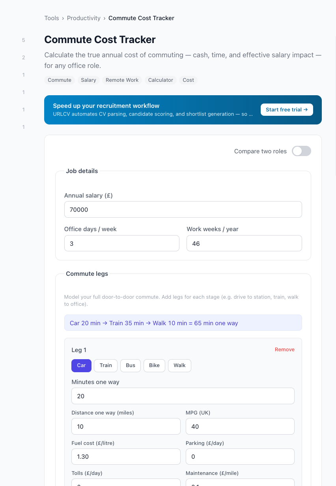

# urlcv/commute-cost-tracker

[](https://www.php.net)
[](LICENSE)

Frontend-only calculator that reveals the hidden annual cost of commuting for office roles.

> **Live demo:** [urlcv.com/tools/commute-cost-tracker](https://urlcv.com/tools/commute-cost-tracker)
> This package powers the free Commute Cost Tracker tool on **[URLCV](https://urlcv.com)** — the recruitment platform that helps agencies present candidates professionally.

---

## Features

- **Annual cash cost** — fuel, tickets, parking, tolls, maintenance and depreciation
- **Annual time cost** — total commute hours and equivalent workdays
- **Time value cost** — commute time priced at the user's hourly rate
- **Effective salary** — gross salary minus cash cost minus time value cost
- **Comparison mode** — side-by-side comparison of two roles (e.g. Office vs Remote)
- **Copy-to-clipboard share block** — preformatted text for LinkedIn / email
- Supports car, train, bus, bike and walking commutes
- Runs entirely in the browser (Alpine.js) — zero server load

---

## Formulas

| Variable | Formula |
|---|---|
| `commute_trips_per_year` | `office_days_per_week × work_weeks_per_year` |
| `commute_minutes_per_year` | `minutes_one_way × 2 × commute_trips_per_year` |
| `commute_hours_per_year` | `commute_minutes_per_year / 60` |
| `hourly_rate` | `salary / (work_weeks_per_year × 40)` |
| `time_value_cost` | `commute_hours_per_year × hourly_rate` |

### Cash cost — Car

| Component | Formula |
|---|---|
| `miles_per_year` | `distance_one_way_miles × 2 × commute_trips_per_year` |
| `fuel_gallons_per_year` | `miles_per_year / mpg` |
| `litres_per_year` | `fuel_gallons_per_year × 4.54609` (UK gallon) |
| `fuel_cost` | `litres_per_year × fuel_cost_per_litre` |
| `parking_cost` | `parking_per_day × commute_trips_per_year` |
| `toll_cost` | `tolls_per_day × commute_trips_per_year` |
| `maintenance_cost` | `maintenance_per_mile × miles_per_year` |
| `depreciation_cost` | `depreciation_per_mile × miles_per_year` |
| **Total cash cost** | Sum of all above |

### Cash cost — Train / Bus

`ticket_cost_per_day × commute_trips_per_year`

### Cash cost — Bike

`bike_maintenance_per_year` (optional, default 0)

### Cash cost — Walk

`0`

### Effective salary

`salary − cash_cost − time_value_cost`

### Life days

`commute_hours_per_year / 16` (based on 16 waking hours per day)

---

## Screenshot



---

## Requirements

- PHP **8.1** or higher (for the Laravel service provider)
- Alpine.js (loaded by the host application)

---

## Installation

```bash
composer require urlcv/commute-cost-tracker
```

The Laravel service provider auto-registers via Composer's `extra.laravel.providers`.

---

## About URLCV

[URLCV](https://urlcv.com) is a recruitment platform for agencies. It helps recruiters present candidates professionally with branded shortlists, structured CV parsing, and candidate tracking.

Explore all free tools at **[urlcv.com/tools](https://urlcv.com/tools)**.

---

## License

MIT — see [LICENSE](LICENSE).
